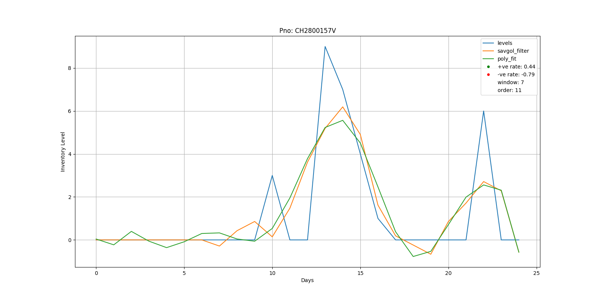

# Time-Spark

A small python package for time series analysis on Spark. 

# You can do the following:
* Load data from multiple CSV files in to Spark RDD
* Create a data structure with selected columns for time series analysis.
* Apply Savitzky Golay filtering algorithm for data smoothing. 
* Fit a polynomial function of Nth order to the entire data or its subset.
* Find the derivative and rate of increase or decrease of the data. 

## Note: This project is in development stage.  
